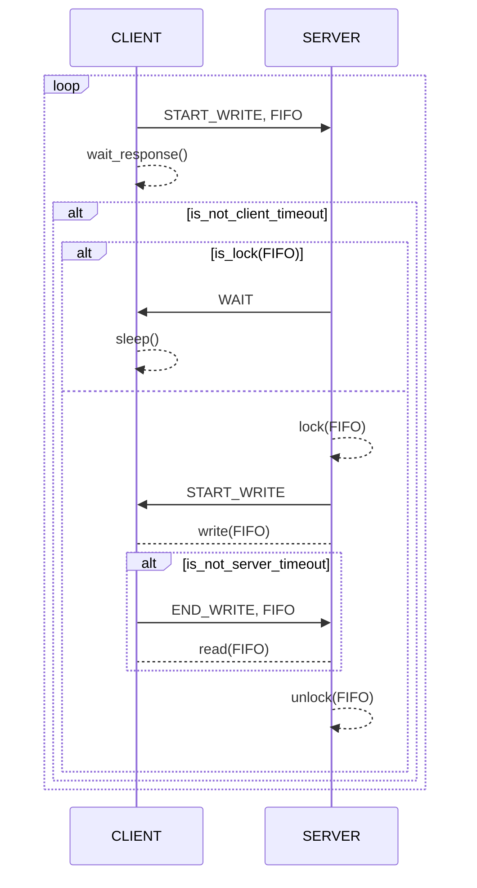

# Client-Server IPC

Inter-process communication system using a client-server architecture.

### Authors:
- **Bottini, Franco Nicolas**

### How to compile?

To compile the project, once you have cloned the repository, simply create the Makefile using the CMake script and run it:

```bash
$ git clone https://github.com/francobottini99/LINUXCLIENTSERVER1-2023.git
$ cd LINUXCLIENTSERVER1-2023
$ cmake .
$ make
```

This will generate two executables located in the `/bin` folder: `Client` and `Server`.

## Client

The `Client` binary generates processes that communicate with the server via different **IPC** mechanisms, these are:

- *FIFO* (0)
- *SHARED MEMORY* (1)
- *MESSAGE QUEUE* (2)

Once a client process is created, it sends the first message to the server within a pseudo-random interval of 0 to 3 seconds. After that, the message sending repeats at pseudo-random intervals between 1 and 5 seconds. The client continues running indefinitely until it is terminated by the user, or until the server execution ends. The messages sent are simply sequential integers starting from 0.

To create a client process, the server process must be running, and the type of **IPC** mechanism the new client will use must be passed as an argument to the binary:

```bash
$ ./bin/Client 0 # Runs a FIFO client
$ ./bin/Client 1 # Runs a SHARED MEMORY client
$ ./bin/Client 2 # Runs a MESSAGE QUEUE client
```

You can run as many client processes as desired. These processes can run in the background using `&`:

```bash
$ ./bin/Client 0 & # Runs a FIFO client in the background
$ ./bin/Client 1 & # Runs a SHARED MEMORY client in the background
$ ./bin/Client 2 & # Runs a MESSAGE QUEUE client in the background
```

You can generate `N` background client processes using the `Create.bash` script located in the `/test` directory. It takes as input the number of clients to create:

```bash
$ ./test/Create.bash 100 # Runs 100 clients in the background
```

The script defines the communication type for each of these `N` clients randomly. That is, when running 100 clients, approximately 33 FIFO clients, 33 SHARED MEMORY clients, and 33 MESSAGE QUEUE clients will be created. To know the number of active clients running in the system (both foreground and background), you can use the `Active.bash` script:

```bash
$ ./test/Active.bash # Prints the number of active client processes
```

Furthermore, to terminate all active client processes (both foreground and background), you can use the `Clear.bash` script:

```bash
$ ./test/Clear.bash # Ends all active client processes
```

These two scripts are also located in the `/test` directory.

## Server

The `Server` binary runs the server process that the system's clients will connect to. This process controls the flow of messages generated by the clients through the three different **IPC** channels:

- *FIFO*
- *SHARED MEMORY*
- *MESSAGE QUEUE*

To run the server, simply execute the binary:

```bash
$ ./bin/Server # Starts the Server process
```

The process does not allow multiple executions, meaning that only one server process can be running on the machine at a time.

While the server is running, every time it receives a message from a client, it prints the content of the message and the client information. In addition, it displays server execution statistics, which include: the number of messages received from each channel, the number of connection failures (*timeouts*) that occurred in communication, and the message reception rate (messages per second). This data is printed on the console and also persisted in a file located in the `/data` directory with the name:

```
server_stats_{pid_server}_{start_date_time}.txt
```

Thus, for each execution of a server process, there is a file associated with its statistics.

## Logic of Operation

To initiate communication with the server, the client sends a signal requesting to start writing and notifying which channel it wants to use (*FIFO*, *SHARED MEMORY*, or *MESSAGE QUEUE*). The server, upon processing this signal, checks if the requested channel is being used by another client and returns a response signal. There are two possibilities:
- The channel is empty: the server responds with a start write signal and locks the requested channel so that no other client can use it while it is being written to.
- The channel is occupied: the server responds with a wait signal.

In this way, if the client receives a start write signal, it proceeds to write the message in the agreed-upon channel, and once finished, it sends a write end signal. If the client receives a wait signal, it pauses its execution for a pseudo-random time between 10 and 1000 microseconds and repeats the process from the beginning.

Finally, when the server receives a write end signal from a client, it processes the content of the channel previously agreed upon and unlocks it so that another client can use it.

If the server has given the start write signal to a client, there is a maximum lock period for the requested channel of 10 milliseconds. If the client does not notify the end of writing within this time window, a *timeout* occurs, and the channel is automatically released. On the client side, there is a maximum wait period of 1 second to receive a response to the start write request; if this time is exceeded, the request is repeated.

Example of using the *FIFO* channel to transmit a message:


