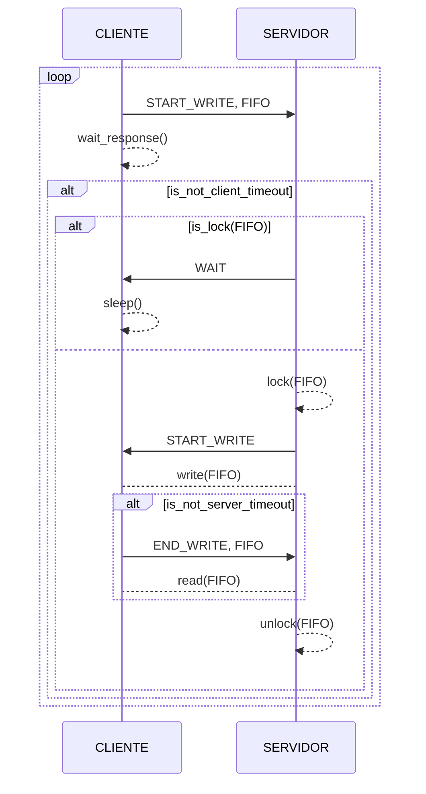

# Client-Server IPC

Sistema de comunicación entre procesos utilizando una arquitectura cliente-servidor. 

### Autores:
- **Bottini, Franco Nicolas**

### ¿ Como compilar ?

Para compilar el proyecto, una vez clonado el repositorio, basta con crear el Makefile utilizando el script CMake y ejecutarlo:

```bash
$ git clone https://github.com/francobottini99/LINUXCLIENTSERVER1-2023.git
$ cd LINUXCLIENTSERVER1-2023
$ cmake .
$ make
```
Como salida obtendremos dos ejecutables ubicados en la carpeta `/bin`: `Client` y `Server`.

## Cliente

Con el binario `Client` se generan los procesos que se van a comunicar con el servidor por medio de diferentes mecanismos de **IPC**, estos son:

- *FIFO* (0)
- *SHARED MEMORY* (1)
- *MESSAGE QUEUE* (2)

Una vez creado un proceso cliente, este enviara el primer mensaje al servidor en un plazo pseudoaleatorio de 0 a 3 segundo, luego de esto, el envió de mensajes se repite en intervalos pseudoaleatorios de entre 1 y 5 segundos. El cliente continua su ejecución indefinidamente hasta que es finalizado por el usuario, o en su defecto, hasta que finaliza la ejecución del servidor. Los mensajes enviados son simplemente números enteros secuenciales comenzando desde el 0.

Para crear un proceso cliente es necesario que el proceso servidor este en ejecución en el equipo y se debe dar como argumento de entrada al binario el tipo de mecanismo **IPC** que va a utilizar el nuevo cliente:
```bash
$ ./bin/Client 0 # Ejecuta un cliente FIFO
$ ./bin/Client 1 # Ejecuta un cliente SHARED MEMORY
$ ./bin/Client 2 # Ejecuta un cliente MESSAGE QUEUE
```
Se pueden ejecutar tantos procesos cliente como se desee. Estos procesos admiten la ejecución en segundo plano utilizando `&`:
```bash
$ ./bin/Client 0 & # Ejecuta un cliente FIFO en segundo plano
$ ./bin/Client 1 & # Ejecuta un cliente SHARED MEMORY en segundo plano
$ ./bin/Client 2 & # Ejecuta un cliente MESSAGE QUEUE en segundo plano
```
Se pueden generar `N` procesos clientes en segundo plano utilizando el script `Create.bash` ubicado en el directorio `/test`. Este recibe como argumento de entrada el numero de clientes a crear:
```bash
$ ./test/Create.bash 100 # Ejecuta 100 clientes en segundo plano
```
El script define el tipo de comunicación para cada uno de estos `N` clientes de manera aleatoria uniforme. Es decir ejecutando 100 clientes se crearan aproximadamente 33 clientes *FIFO*, 33 clientes *SHARED MEMORY* y 33 clientes *MESSAGE QUEUE*.
Para conocer el numero de clientes activos corriendo en el sistema (en primer y segundo plano), se puede utilizar el script `Active.bash`:
```bash
$ ./test/Active.bash # Imprime en consola el numero de procesos cliente activos
```
Por otra parte, para finalizar la ejecución de todos los clientes activos (en primer y segundo plano), se puede utilizar el script `Clear.bash`:
```bash
$ ./test/Clear.bash # Finaliza la ejecucion de todos los procesos cliente activos
```
Estos dos scripts tambien se encuentran el directorio `/test`.

## Servidor

El binario `Server` ejecuta el proceso servidor al que se van a conectar los clientes del sistema. Este proceso controla el flujo de mensajes generados por los clientes a través de los tres distintos canales **IPC**:

- *FIFO*
- *SHARED MEMORY*
- *MESSAGE QUEUE*

Para ejecutar el servidor basta con ejecutar el binario: 
```bash
$ ./bin/Server # Lanza el proceso Servidor
```
El proceso no admite múltiples ejecuciones, es decir, no  puede haber mas de un proceso servidor corriendo en el equipo al mismo tiempo.

Mientras el servidor este en ejecución, cada vez que se recibe un mensaje de un cliente, se imprime en consola el contenido del mensaje y la información del cliente que lo envió. Sumado a esto, se muestran las estadísticas de ejecución del servidor, donde se recopila: la cantidad de mensajes recibidos por cada canal, la cantidad de fallos de conexión ocurridos (*timeout*) en la comunicación y la taza de recepción de mensajes (mensajes / segundos). Estos datos, ademas de imprimirse por consola, persisten en un archivo ubicado en el directorio `/data` con el nombre: 
```
server_stats_{pid_server}_{fecha_hora_de_inicio}.txt
```
De esta manera, para cada ejecución de un proceso servidor, existe un archivo asociado con sus estadísticas.

## Lógica de Funcionamiento

Para comenzar una comunicación con el servidor, el cliente le envía una señal a este solicitando un inicio de escritura y notificando el canal que quiere utilizar (*FIFO*, *SHARED MEMORY* o *MESSAGE QUEUE*). El servidor al procesar esta señal, verifica si el canal solicitado esta siendo utilizado por otro cliente y retorna una señal de respuesta, existen dos posibilidades: 
- El canal esta vació: el servidor responde con una señal de inicio de escritura y bloquea el canal solicitado para que otro cliente no lo use mientras se esta escribiendo en el. 
- El canal esta ocupado: el servidor responde con una señal de espera. 

De esta manera, si el cliente recibe una señal de inicio de escritura, procede a escribir el mensaje en el canal acordado y al finalizar envía una señal de fin de escritura. En caso de que el cliente reciba una señal de espera, pausa su ejecución un tiempo pseudoaletorio de entre 10 y 1000 micro segundos y repite el proceso desde el inicio. 

Finalmente, cuando el servidor recibe una señal de fin de escritura por parte de un cliente, procese a leer el contenido del canal acordado previamente entre ambos y lo desbloquea para ser utilizado por otro cliente. 

En caso de que el servidor haya dado la señal de inicio de escritura a un cliente, se establece un periodo máximo de bloqueo del canal solicitado de 10 mili segundos, si en esta ventana de tiempo el cliente no notifico el final de escritura, se produce un *timeout* y se libera el canal automáticamente. Del lado del cliente, existe un periodo de espera máximo de 1 segundo para recibir una respuesta al pedido de inicio de escritura, superado este tiempo se repite la solicitud. 

Ejemplo de utilizacion del canal *FIFO* para transmitir un mensaje:


